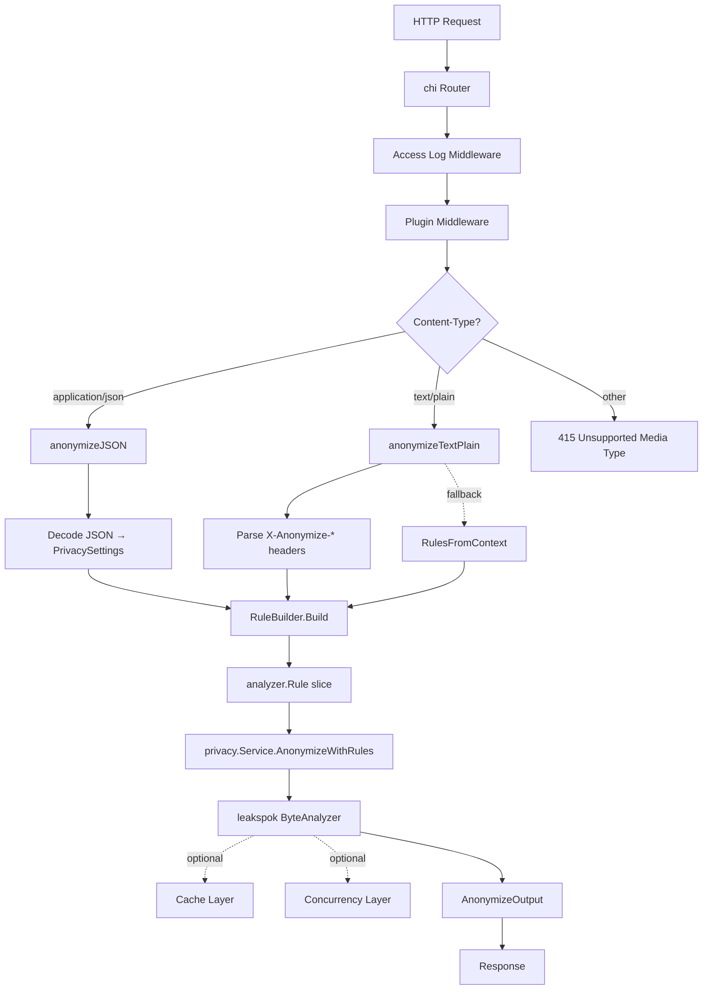

# Phase 4: Comprehensive Documentation — Implementation Plan

> **For agentic workers:** REQUIRED SUB-SKILL: Use superpowers:subagent-driven-development (recommended) or superpowers:executing-plans to implement this plan task-by-task. Steps use checkbox (`- [ ]`) syntax for tracking.

**Goal:** Produce 10 new documentation files, 1 docker-compose.yml, and update 4 existing files to create a complete documentation suite for the anonymizer service.

**Architecture:** Plain Markdown files in flat `docs/` directory, no static site generator. Deduplication: entity tables and error tables each live in ONE canonical file; endpoint docs and README link to them. Getting-started uses Docker, not Taskfile.

**Tech Stack:** Markdown, YAML (OpenAPI 3.1), Mermaid (architecture diagram)

---

### Task 1: Create docker-compose.yml

**Files:**
- Create: `docker-compose.yml`

- [ ] **Step 1: Write docker-compose.yml at project root**

```yaml
services:
  redis:
    image: redis:7-alpine
    ports:
      - "6379:6379"
    healthcheck:
      test: ["CMD", "redis-cli", "ping"]
      interval: 5s
      timeout: 3s
      retries: 5

  anonymizer:
    build: .
    ports:
      - "8080:8080"
    environment:
      - PORT=8080
      - LOG_LEVEL=INFO
      - PRIVACY_CACHE_ENABLED=true
      - PRIVACY_CACHE_REDIS_ADDR=redis:6379
    depends_on:
      redis:
        condition: service_healthy
    healthcheck:
      test: ["CMD", "wget", "--no-verbose", "--tries=1", "--spider", "http://localhost:8080/health"]
      interval: 10s
      timeout: 5s
      retries: 3
```

- [ ] **Step 2: Verify file was created**

Run: `ls -la docker-compose.yml`
Expected: file exists at project root

- [ ] **Step 3: Commit**

```bash
git add docker-compose.yml
git commit -m "feat: add docker-compose.yml with Redis and anonymizer service"
```

---

### Task 2: Create docs/entities.md

**Files:**
- Create: `docs/entities.md`

- [ ] **Step 1: Write docs/entities.md**

```markdown
# Entity Reference

This is the canonical reference for all PII entity types supported by the anonymizer. Entity names are **case-insensitive** in requests (`email`, `Email`, and `EMAIL` are all accepted).

## Supported Entities

| Name | Aliases | Description | Example Detections |
|------|---------|-------------|-------------------|
| `EMAIL` | — | Email addresses | `user@example.com` |
| `CPF_NUMBER` | — | Brazilian CPF with check-digit validation | `123.456.789-09`, `12345678909` |
| `CNPJ_NUMBER` | — | Brazilian CNPJ with check-digit validation | `12.345.678/0001-90` |
| `IP_ADDRESS` | `IP` | IPv4 and IPv6 addresses | `192.168.1.1`, `::1` |
| `IPV4` | — | IPv4 addresses only | `192.168.1.1` |
| `IPV6` | — | IPv6 addresses only | `::1`, `2001:db8::1` |
| `CREDIT_CARD` | — | Credit card numbers | `4111-1111-1111-1111` |
| `PHONE` | — | Phone numbers, international and Brazilian formats | `+55 11 99999-9999` |
| `LINK` | `URL` | URLs and hyperlinks | `https://example.com` |
| `SSN` | — | US Social Security Numbers | `123-45-6789` |
| `ADDRESS` | — | Street addresses | `123 Main St, Springfield` |
| `BANK_INFO` | — | Banking information including IBAN | `DE89 3704 0044` |
| `UUID` | — | UUIDs and GUIDs | `550e8400-e29b-41d4-a716-446655440000` |

## Custom Entities

Adding new entity types requires changes to the [leakspok](https://github.com/Prosus-Cyber-Xchange/leakspok) library's `pattern` package. Custom matchers can be registered in leakspok and then mapped in the anonymizer's rule builder.

## See Also

- [Redaction Strategies](./redaction.md) — how to configure anonymization per entity
- [POST /api/v1/anonymize](./anonymize.md) — endpoint documentation with request examples
```

- [ ] **Step 2: Commit**

```bash
git add docs/entities.md
git commit -m "feat: add entity reference documentation"
```

---

### Task 3: Create docs/errors.md

**Files:**
- Create: `docs/errors.md`

- [ ] **Step 1: Write docs/errors.md**

```markdown
# Error Reference

This is the canonical reference for all error codes returned by the anonymizer. Error responses are always JSON.

## Error Response Format

```json
{
  "code": "ERROR_CODE",
  "error": "Human-readable description"
}
```

## Error Codes

| HTTP Status | Code | Cause | Resolution |
|-------------|------|-------|------------|
| `400` | `INVALID_REQUEST` | Malformed JSON body or failed to read request body | Check that the request body is valid JSON |
| `400` | `INVALID_SETTINGS` | Settings validation failed — empty entities, missing redaction or mask, invalid exception operator, or unsupported entity type | Check entity names and ensure each entity has either `redaction` or `mask` defined |
| `400` | `BATCH_SIZE_EXCEEDED` | Number of batch items exceeds `MAX_BATCH_SIZE` (default: `100`) | Reduce batch size or increase `MAX_BATCH_SIZE` |
| `400` | `NO_RULES` | text/plain request without `X-Anonymize-Entities` header and no context-injected rules | Add `X-Anonymize-Entities` header or configure a plugin to inject rules |
| `415` | `UNSUPPORTED_MEDIA_TYPE` | Unsupported `Content-Type` on `/api/v1/anonymize`, or non-JSON `Content-Type` on `/api/v1/anonymize/batch` | Use `application/json` or `text/plain` |
| `500` | `ANONYMIZATION_FAILED` | Unexpected internal error during anonymization processing | Check server logs for details |

## See Also

- [POST /api/v1/anonymize](./anonymize.md) — per-endpoint error details
- [POST /api/v1/anonymize/batch](./batch.md) — per-endpoint error details
```

- [ ] **Step 2: Commit**

```bash
git add docs/errors.md
git commit -m "feat: add error reference documentation"
```

---

### Task 4: Create docs/redaction.md

**Files:**
- Create: `docs/redaction.md`

- [ ] **Step 1: Write docs/redaction.md**

```markdown
# Redaction Strategies

The anonymizer supports two strategies for hiding PII: **redaction** (full replacement) and **mask** (partial replacement). Each entity can independently choose its strategy.

## Redaction

Redaction replaces the entire matched value with a fixed placeholder string.

**Configuration:**

```json
{
  "redaction": {
    "replacement": "<EMAIL_REDACTED>"
  }
}
```

| Field | Required | Description |
|-------|----------|-------------|
| `replacement` | Yes | The string that replaces the detected value |

**Example:**

| Input | Settings | Output |
|-------|----------|--------|
| `john@example.com` | `replacement: "<EMAIL>"` | `<EMAIL>` |

## Mask

Mask replaces the first N characters of the matched value with a masking character, preserving the rest of the value.

**Configuration:**

```json
{
  "mask": {
    "replacement": "*",
    "maxLength": 4
  }
}
```

| Field | Required | Description |
|-------|----------|-------------|
| `replacement` | Yes | Character used for masking (typically a single character like `*` or `#`) |
| `maxLength` | Yes | Number of characters to mask (must be > 0) |

**Example:**

| Input | Settings | Output |
|-------|----------|--------|
| `123.456.789-09` | `replacement: "*"`, `maxLength: 4` | `****.456.789-09` |

## Precedence

If both `redaction` and `mask` are defined for the same entity, **redaction takes precedence**. The mask configuration is ignored.

## Per-Entity Configuration

Each entity in the `entities` array can independently choose redaction, mask, or both. This means you can redact emails while masking CPF numbers in the same request:

```json
{
  "entities": [
    { "name": "EMAIL", "redaction": { "replacement": "<EMAIL>" } },
    { "name": "CPF_NUMBER", "mask": { "replacement": "*", "maxLength": 3 } }
  ]
}
```

## See Also

- [Entity Reference](./entities.md) — supported entity types
- [POST /api/v1/anonymize](./anonymize.md) — endpoint documentation with full examples
```

- [ ] **Step 2: Commit**

```bash
git add docs/redaction.md
git commit -m "feat: add redaction strategies documentation"
```

---

### Task 5: Create docs/content-negotiation.md

**Files:**
- Create: `docs/content-negotiation.md`

- [ ] **Step 1: Write docs/content-negotiation.md**

```markdown
# Content Negotiation

The `/api/v1/anonymize` endpoint accepts two content types, letting you choose between structured JSON requests and lightweight header-based text/plain requests.

## Overview

| Content-Type | Use Case | Best For |
|-------------|----------|----------|
| `application/json` | Inline privacy settings in the request body | Complex settings with exceptions per entity |
| `text/plain` | Rules via HTTP headers, raw text body | Simple rules, piping large text without JSON overhead |

## JSON Mode (`application/json`)

Rules are provided inline in the request body under the `settings` field. Each entity can have its own redaction or mask strategy, plus per-entity exceptions.

See [POST /api/v1/anonymize](./anonymize.md) for the full request and response format.

## text/plain Mode (`text/plain`)

The request body is the raw text to anonymize. Anonymization rules are configured via HTTP headers.

### Request Headers

| Header | Required | Default | Description |
|--------|----------|---------|-------------|
| `X-Anonymize-Entities` | Yes | — | Comma-separated entity names: `EMAIL,CPF_NUMBER,CREDIT_CARD` |
| `X-Anonymize-Strategy` | No | `redact` | Anonymization strategy: `redact` or `mask` |
| `X-Anonymize-Placeholder` | No | `<REDACTED>` | Replacement string (redact mode only) |
| `X-Anonymize-Mask-Char` | No | `*` | Masking character (mask mode only) |
| `X-Anonymize-Mask-Length` | No | `4` | Characters to mask (mask mode only) |

All entities in `X-Anonymize-Entities` share the same strategy and placeholder/mask settings. If you need different strategies per entity, use JSON mode.

### Response

- **Body:** The anonymized text as raw text (`Content-Type: text/plain; charset=utf-8`)
- **Headers:**

| Header | Description |
|--------|-------------|
| `X-Anonymize-Detected-Entities` | Comma-separated list of detected entity types |
| `X-Anonymize-Anonymized-Entities` | Comma-separated list of anonymized entity types |

### Example

```bash
curl -X POST http://localhost:8080/api/v1/anonymize \
  -H "Content-Type: text/plain" \
  -H "X-Anonymize-Entities: EMAIL,CPF_NUMBER" \
  -H "X-Anonymize-Placeholder: <REDACTED>" \
  -d "Contact john@example.com, CPF 123.456.789-09"
```

Response body:
```
Contact <REDACTED>, CPF <REDACTED>
```

Response headers:
```
Content-Type: text/plain; charset=utf-8
X-Anonymize-Detected-Entities: CPF_NUMBER,EMAIL
X-Anonymize-Anonymized-Entities: CPF_NUMBER,EMAIL
```

## Default Behavior

When no `Content-Type` header is provided, the request is treated as `application/json`.

## Unsupported Content Types

Any `Content-Type` other than `application/json` or `text/plain` returns:

```json
HTTP 415 Unsupported Media Type
{
  "code": "UNSUPPORTED_MEDIA_TYPE",
  "error": "unsupported content type: application/xml"
}
```

## Batch Endpoint

`/api/v1/anonymize/batch` accepts **only** `application/json`. Non-JSON content types return a `415 Unsupported Media Type` error.

## Rule Precedence (text/plain mode)

When a text/plain request arrives, the handler resolves rules in this order:

1. **`X-Anonymize-Entities` header** (highest priority) — if present, the header's entities are used
2. **Context-injected rules** (from plugin middleware) — used when no `X-Anonymize-Entities` header is present
3. **400 `NO_RULES` error** — returned when neither headers nor context rules are available

This allows plugins to set default rules for a service while still letting clients override them per request via headers. See [Plugin Developer Guide](./plugins.md) for details.

## See Also

- [POST /api/v1/anonymize](./anonymize.md) — full JSON endpoint documentation
- [Plugin Developer Guide](./plugins.md) — injecting rules via middleware
```

- [ ] **Step 2: Commit**

```bash
git add docs/content-negotiation.md
git commit -m "feat: add content negotiation documentation"
```

---

### Task 6: Create docs/configuration.md

**Files:**
- Create: `docs/configuration.md`

- [ ] **Step 1: Write docs/configuration.md**

```markdown
# Configuration Reference

The anonymizer is configured entirely through environment variables. This reference organizes all available variables by domain.

## Loading

Environment variables are parsed at startup using `caarlos0/env`. When using `task run`, the Taskfile automatically loads variables from `.env`. Copy `.env.example` to `.env` and adjust as needed.

## Server

| Variable | Default | Description |
|----------|---------|-------------|
| `PORT` | `8080` | HTTP server port |
| `HOST` | `0.0.0.0` | HTTP server host |
| `GRACEFUL_SHUTDOWN_TIMEOUT` | `30s` | Maximum time to wait for in-flight requests during shutdown |
| `MAX_BATCH_SIZE` | `100` | Maximum number of items per batch request |
| `LOG_LEVEL` | `INFO` | Logging level: `DEBUG`, `INFO`, `WARN`, or `ERROR` |
| `SERVICE_NAME` | `""` | Service name for OpenTelemetry |
| `PATTERN_MONITORING_ENABLED` | `false` | Enable leakspok pattern monitoring for debugging |

## Redis / Cache

Cache configuration uses the `PRIVACY_CACHE_` prefix. When caching is enabled, rule matching results are cached to avoid re-evaluating patterns on repeated input.

| Variable | Default | Description |
|----------|---------|-------------|
| `PRIVACY_CACHE_ENABLED` | `false` | Enable rule matching cache |
| `PRIVACY_CACHE_TTL` | `1h` | Cache entry time-to-live |
| `PRIVACY_CACHE_REDIS_ADDR` | `""` | Valkey/Redis address in `host:port` format |
| `PRIVACY_CACHE_REDIS_DISABLE_CLUSTER` | `false` | Use standalone client instead of cluster mode |
| `PRIVACY_CACHE_REDIS_DIAL_TIMEOUT` | `0` | Connection dial timeout |
| `PRIVACY_CACHE_REDIS_READ_TIMEOUT` | `0` | Socket read timeout |
| `PRIVACY_CACHE_REDIS_WRITE_TIMEOUT` | `0` | Socket write timeout |
| `PRIVACY_CACHE_REDIS_POOL_SIZE` | `0` | Maximum connections per CPU |
| `PRIVACY_CACHE_REDIS_MIN_IDLE_CONNS` | `0` | Minimum idle connections in the pool |
| `PRIVACY_CACHE_METRICS` | `true` | Expose cache-specific Prometheus metrics |
| `PRIVACY_CACHE_DISABLE_IN_MEMORY` | `false` | Disable in-memory server-assisted client-side caching |
| `REDIS_ANONYMIZER_SERVICE_V2_CACHE_TOKEN` | `""` | Redis AUTH password |

## Concurrency

Concurrency configuration uses the `PRIVACY_CONCURRENCY_` prefix. These options control parallel processing of tokens and rules within a single request.

| Variable | Default | Description |
|----------|---------|-------------|
| `PRIVACY_CONCURRENCY_ENABLED` | `false` | Enable concurrent processing |
| `PRIVACY_CONCURRENCY_TOKEN_PROCESSING` | `false` | Evaluate tokens in parallel |
| `PRIVACY_CONCURRENCY_RULE_PROCESSING` | `false` | Evaluate rules in parallel |
| `PRIVACY_CONCURRENCY_RULE_RUNNER_POOL_SIZE` | `0` | Goroutine pool size for rule runners |
| `PRIVACY_CONCURRENCY_TOKEN_POOL_SIZE` | `0` | Goroutine pool size for token processing |
| `PRIVACY_CONCURRENCY_MAX_GOROUTINE_IDLE_TIMEOUT` | `10s` | Time before idle goroutines are reclaimed |

Concurrency is most impactful for large text payloads where many tokens and rules need evaluation.

## OpenTelemetry

| Variable | Default | Description |
|----------|---------|-------------|
| `OTEL_ENABLED` | `false` | Enable OpenTelemetry tracing |
| `OTEL_EXPORTER_ADDR` | `localhost:4317` | OTel exporter address |

## See Also

- [Deployment Guide](./deployment.md) — production deployment and scaling
- [Getting Started](./getting-started.md) — quick start with defaults
- [Observability Guide](./observability.md) — metrics, tracing, and logging
```

- [ ] **Step 2: Commit**

```bash
git add docs/configuration.md
git commit -m "feat: add configuration reference documentation"
```

---

### Task 7: Create docs/architecture.md

**Files:**
- Create: `docs/architecture.md`

- [ ] **Step 1: Write docs/architecture.md**

```markdown
# Architecture

## Design Philosophy

The anonymizer is built to handle large text payloads — such as AI prompts and log streams — with minimal overhead. Every design choice targets low latency and efficient resource consumption.

- **Byte-level processing:** The entire pipeline uses `[]byte`. No string conversions, no unnecessary allocations. The `ByteString` type enables zero-copy JSON marshaling.
- **Buffer pooling:** `sync.Pool` reuses response buffers and entity maps across requests, reducing GC pressure under load.
- **Pluggable caching:** Rule matching results are cached. In-memory client-side caching avoids network round-trips for hot paths. Optional Redis/Valkey backends share state across replicas using server-assisted client-side caching.
- **Optional concurrency:** Token-level and rule-level parallelism can be enabled independently to saturate multiple CPU cores for large payloads.

## Request Flow



## Component Map

| Package | Responsibility | Public API |
|---------|---------------|------------|
| `pkg/server/` | Application builder, functional options, plugin registration, HTTP handler assembly | `AnonymizerServer`, `Option`, `WithPlugin`, `WithLogger`, `WithByteAnalyzer`, `CoreServices`, `MiddlewareRegistrar` |
| `internal/handler/` | HTTP handlers, content-type dispatch, JSON/text-plain parsing, error responses, buffer pooling | (internal) |
| `internal/monitoring/` | OpenTelemetry tracing, Prometheus metrics registry | (internal) |
| `pkg/privacy/` | Core anonymization service, rule builder, privacy settings types | `Service`, `RuleBuilder`, `PrivacySettings`, `EntitySettings`, `RedactionSettings`, `MaskSettings` |
| `pkg/config/` | Environment variable loading, YAML rules loading, settings validation | `EnvConfig`, `ServerConfig`, `YAMLRulesLoader`, `ValidatePrivacyConfig` |
| `pkg/context/` | Context key/value helpers for rule injection | `WithRules`, `RulesFromContext` |

## Plugin System

Plugins implement the `MiddlewareRegistrar` interface to inject HTTP middleware that runs before the core anonymization handler:

```go
type MiddlewareRegistrar interface {
    Middleware(services CoreServices) func(http.Handler) http.Handler
}
```

The `CoreServices` struct provides plugins with a `*slog.Logger` and `analyzer.ByteAnalyzer`. Plugins inject rules into the request context via `WithRules(ctx, rules)`, and the handler retrieves them via `RulesFromContext(ctx)` as a fallback when no inline settings or headers are present.

See [Plugin Developer Guide](./plugins.md) for a complete walkthrough.

## Cache Layer

- **In-memory client-side caching:** Enabled by default when `PRIVACY_CACHE_ENABLED=true`. Uses Valkey's server-assisted client-side caching protocol to minimize network overhead.
- **Redis/Valkey backend:** Optional shared cache for multi-replica deployments. Configured via `PRIVACY_CACHE_REDIS_ADDR`.
- **Disable in-memory:** Set `PRIVACY_CACHE_DISABLE_IN_MEMORY=true` to use only the Redis backend.

## Concurrency Layer

When `PRIVACY_CONCURRENCY_ENABLED=true`:

- **Token-level parallelism:** Multiple tokens in a text are evaluated simultaneously. Controlled by `PRIVACY_CONCURRENCY_TOKEN_PROCESSING` and `PRIVACY_CONCURRENCY_TOKEN_POOL_SIZE`.
- **Rule-level parallelism:** Multiple rules are evaluated against each token simultaneously. Controlled by `PRIVACY_CONCURRENCY_RULE_PROCESSING` and `PRIVACY_CONCURRENCY_RULE_RUNNER_POOL_SIZE`.
- **Goroutine pools:** Sized goroutine pools with configurable idle reclamation (`PRIVACY_CONCURRENCY_MAX_GOROUTINE_IDLE_TIMEOUT`) prevent unbounded goroutine growth on large texts.

## See Also

- [Observability Guide](./observability.md) — metrics, tracing, and logging
- [Configuration Reference](./configuration.md) — all environment variables
- [Plugin Developer Guide](./plugins.md) — extending the service
```

- [ ] **Step 2: Commit**

```bash
git add docs/architecture.md
git commit -m "feat: add architecture documentation with design philosophy and flow diagram"
```

---

### Task 8: Create docs/observability.md

**Files:**
- Create: `docs/observability.md`

- [ ] **Step 1: Write docs/observability.md**

```markdown
# Observability Guide

## Logging

The anonymizer uses Go's standard library `log/slog` for structured logging.

- **Format:** JSON (production). Each log line is a JSON object with `time`, `level`, `msg`, and contextual attributes.
- **Levels:** `DEBUG`, `INFO`, `WARN`, `ERROR` — set via `LOG_LEVEL` env var (default: `INFO`).
- **What gets logged:**
  - Request start with `request_id`
  - Failed request body decoding
  - Invalid privacy settings
  - Anonymization errors
  - Batch size exceeded warnings
  - Server startup and shutdown events
  - Plugin events (plugin-specific)

**Example log output:**

```json
{"time":"2026-01-01T00:00:00Z","level":"INFO","msg":"Starting HTTP server","addr":"0.0.0.0:8080"}
```

## Metrics

Prometheus metrics are exposed at `/metrics` (scraped by Prometheus).

### Core Metrics

| Metric | Type | Description |
|--------|------|-------------|
| `yggdrasil_authorizer_privacy_anonymization_duration` | Histogram | Anonymization operation duration in ms. Buckets: 1ms to 20s. |
| `yggdrasil_authorizer_privacy_anonymized_entity_count` | Counter | Count of anonymized entities, tagged by `entity` |
| `yggdrasil_authorizer_privacy_request_body_size` | Histogram | Request body size in bytes |

### Cache Metrics

When `PRIVACY_CACHE_METRICS=true` (default), cache operations are instrumented with Prometheus metrics covering hits, misses, and invalidation events.

### Access Logs

Every request is logged via chi middleware with method, path, status code, duration, and content type. The `/health` endpoint is excluded from access logging.

## Tracing

OpenTelemetry distributed tracing is available when `OTEL_ENABLED=true`.

- **Exporter:** Configured via `OTEL_EXPORTER_ADDR` (default: `localhost:4317`). Works with any OTLP-compatible collector (Jaeger, Grafana Tempo, Datadog Agent).
- **Tracer name:** `anonymizer-service`
- **Span names:**
  - `anonymize_json_request` — JSON anonymize request
  - `anonymize_textplain_request` — text/plain anonymize request
  - `anonymize_batch_request` — batch anonymize request
- **Span attributes:** entity count, content type, detected entities, error codes (on failure)

## Health Check

```
GET /health
```

Returns `200 OK` with `Content-Type: application/json`. This is a simple liveness probe — it does not check Redis connectivity.

```json
{}
```

## See Also

- [Configuration Reference](./configuration.md) — `LOG_LEVEL`, `OTEL_*`, and `PRIVACY_CACHE_METRICS`
- [Deployment Guide](./deployment.md) — readiness probes and health checks in K8s
```

- [ ] **Step 2: Commit**

```bash
git add docs/observability.md
git commit -m "feat: add observability guide covering logging, metrics, tracing, and health"
```

---

### Task 9: Create docs/deployment.md

**Files:**
- Create: `docs/deployment.md`

- [ ] **Step 1: Write docs/deployment.md**

```markdown
# Deployment Guide

## Docker

### Build

```bash
docker build -t anonymizer .
```

The provided `Dockerfile` uses a multi-stage build: it compiles a static binary in a `golang:1.25.0-alpine` builder stage and copies it into a minimal `alpine:3.21` runtime image.

### Run

```bash
docker run -p 8080:8080 --env-file .env anonymizer
```

Copy `.env.example` to `.env` and adjust configuration before running.

### Docker Compose

The repository includes a `docker-compose.yml` that starts the anonymizer with a Redis cache backend:

```bash
docker compose up
```

This starts:
- **Redis 7 Alpine** on port `6379` (with health check)
- **Anonymizer** on port `8080` (with Redis caching enabled)

Verify the service is healthy:

```bash
curl http://localhost:8080/health
```

Stop:

```bash
docker compose down
```

## Kubernetes

### Minimal Deployment

```yaml
apiVersion: apps/v1
kind: Deployment
metadata:
  name: anonymizer
spec:
  replicas: 1
  selector:
    matchLabels:
      app: anonymizer
  template:
    metadata:
      labels:
        app: anonymizer
    spec:
      containers:
        - name: anonymizer
          image: anonymizer:latest
          ports:
            - containerPort: 8080
          envFrom:
            - configMapRef:
                name: anonymizer-config
          readinessProbe:
            httpGet:
              path: /health
              port: 8080
            initialDelaySeconds: 5
            periodSeconds: 10
          livenessProbe:
            httpGet:
              path: /health
              port: 8080
            initialDelaySeconds: 15
            periodSeconds: 20
```

### ConfigMap Example

```yaml
apiVersion: v1
kind: ConfigMap
metadata:
  name: anonymizer-config
data:
  PORT: "8080"
  LOG_LEVEL: "INFO"
  MAX_BATCH_SIZE: "100"
  PRIVACY_CACHE_ENABLED: "true"
  PRIVACY_CACHE_REDIS_ADDR: "redis-service:6379"
```

### Service

```yaml
apiVersion: v1
kind: Service
metadata:
  name: anonymizer
spec:
  selector:
    app: anonymizer
  ports:
    - port: 8080
      targetPort: 8080
  type: ClusterIP
```

## Scaling Considerations

- **Stateless except for cache:** The anonymizer is stateless. All state lives in Redis when caching is enabled. Without Redis, each replica maintains its own independent cache.
- **Redis for multi-replica:** When running multiple replicas, configure `PRIVACY_CACHE_REDIS_ADDR` to share cached rule matching results across instances.
- **Memory:** Buffer pooling via `sync.Pool` reduces GC pressure. Each request allocates approximately 3x the input size for processing.
- **CPU:** Enable concurrency (`PRIVACY_CONCURRENCY_*`) for workloads with large text payloads where parallel token and rule evaluation improves throughput.

## Security

- **No hardcoded credentials:** All configuration comes from environment variables.
- **Redis authentication:** Use `REDIS_ANONYMIZER_SERVICE_V2_CACHE_TOKEN` to authenticate with password-protected Redis instances.
- **Input limits:** The leakspok library enforces input size limits (default 10MB) to prevent memory exhaustion.

## See Also

- [Getting Started](./getting-started.md) — quick start with Docker
- [Configuration Reference](./configuration.md) — all environment variables
- [Architecture](./architecture.md) — internal design and performance optimizations
```

- [ ] **Step 2: Commit**

```bash
git add docs/deployment.md
git commit -m "feat: add deployment guide covering Docker, K8s, and scaling"
```

---

### Task 10: Create docs/getting-started.md

**Files:**
- Create: `docs/getting-started.md`

- [ ] **Step 1: Write docs/getting-started.md**

````markdown
# Getting Started

The anonymizer is a high-performance PII anonymization service designed for large text payloads such as AI prompts. Byte-level processing, buffer pooling, and optional concurrency ensure low latency and minimal resource consumption.

## Prerequisites

- **Docker** (recommended) — for the quickest start with Redis caching
- **Go 1.22+** — for running the service directly

## Option 1: Docker (Recommended)

```bash
# Clone the repository
git clone https://github.com/Prosus-Cyber-Xchange/anonymizer.git
cd anonymizer

# Start Redis + anonymizer
docker compose up
```

Wait for both services to show as healthy, then verify:

```bash
curl http://localhost:8080/health
```

Stop when done:

```bash
docker compose down
```

## Option 2: Manual (Go)

```bash
# Clone the repository
git clone https://github.com/Prosus-Cyber-Xchange/anonymizer.git
cd anonymizer

# Configure environment
cp .env.example .env

# Run the service
go run cmd/server/main.go
```

Verify:

```bash
curl http://localhost:8080/health
```

## First Request — JSON

Anonymize an email and CPF number using inline privacy settings:

```bash
curl -X POST http://localhost:8080/api/v1/anonymize \
  -H "Content-Type: application/json" \
  -d '{
    "text": "Contact john@example.com, CPF: 123.456.789-09",
    "settings": {
      "entities": [
        { "name": "EMAIL", "redaction": { "replacement": "<EMAIL>" } },
        { "name": "CPF_NUMBER", "redaction": { "replacement": "<CPF>" } }
      ]
    }
  }'
```

Response:

```json
{
  "anonymized_text": "Contact <EMAIL>, CPF: <CPF>",
  "detected_entities": ["CPF_NUMBER", "EMAIL"],
  "anonymized_entities": ["CPF_NUMBER", "EMAIL"]
}
```

## First Request — text/plain

The text/plain mode is ideal for piping large text directly without JSON overhead:

```bash
curl -X POST http://localhost:8080/api/v1/anonymize \
  -H "Content-Type: text/plain" \
  -H "X-Anonymize-Entities: EMAIL" \
  -H "X-Anonymize-Placeholder: <REDACTED>" \
  -d "Contact john@example.com"
```

Response body:

```
Contact <REDACTED>
```

Response headers include `X-Anonymize-Detected-Entities: EMAIL` and `X-Anonymize-Anonymized-Entities: EMAIL`.

## First Batch Request

Anonymize multiple texts in one request:

```bash
curl -X POST http://localhost:8080/api/v1/anonymize/batch \
  -H "Content-Type: application/json" \
  -d '[
    {
      "text": "Email: john@example.com",
      "settings": { "entities": [{ "name": "EMAIL", "redaction": { "replacement": "<EMAIL>" } }] }
    },
    {
      "text": "CPF: 123.456.789-09",
      "settings": { "entities": [{ "name": "CPF_NUMBER", "redaction": { "replacement": "<CPF>" } }] }
    }
  ]'
```

## Using as a Library

The anonymizer can be embedded in any Go application:

```go
package main

import (
    "context"
    "log"

    "github.com/Prosus-Cyber-Xchange/anonymizer/pkg/server"
)

func main() {
    anonymizer, err := server.NewFromConfig(context.Background())
    if err != nil {
        log.Fatal(err)
    }

    // Embed in your existing server
    mux := http.NewServeMux()
    mux.Handle("/anon/", http.StripPrefix("/anon", anonymizer.Handler()))

    // Or run standalone
    anonymizer.ListenAndServe(context.Background())
}
```

## Next Steps

- [Content Negotiation](./content-negotiation.md) — JSON vs text/plain modes in detail
- [Entity Reference](./entities.md) — all supported PII types
- [Redaction Strategies](./redaction.md) — redact and mask configuration
- [Configuration Reference](./configuration.md) — all environment variables
- [Plugin Developer Guide](./plugins.md) — extend the service with custom middleware
- [Deployment Guide](./deployment.md) — production deployment with Docker and Kubernetes
````

- [ ] **Step 2: Commit**

```bash
git add docs/getting-started.md
git commit -m "feat: add getting started guide"
```

---

### Task 11: Create docs/openapi.yaml

**Files:**
- Create: `docs/openapi.yaml`

- [ ] **Step 1: Write docs/openapi.yaml**

```yaml
openapi: "3.1.0"
info:
  title: Anonymizer API
  version: "1.0.0"
  description: |
    REST API for detecting and anonymizing PII (Personally Identifiable Information).
    Supports both JSON (inline privacy settings) and text/plain (header-based rules) content negotiation.
  license:
    name: Apache 2.0
    url: https://www.apache.org/licenses/LICENSE-2.0
servers:
  - url: http://localhost:8080
    description: Local development server
paths:
  /health:
    get:
      summary: Health check
      operationId: healthCheck
      responses:
        "200":
          description: Service is healthy
          content:
            application/json:
              schema:
                type: object
  /api/v1/anonymize:
    post:
      summary: Anonymize PII in text
      operationId: anonymize
      requestBody:
        required: true
        content:
          application/json:
            schema:
              $ref: "#/components/schemas/AnonymizeRequest"
            examples:
              redactEmail:
                summary: Redact an email address
                value:
                  text: "Contact john@example.com"
                  settings:
                    entities:
                      - name: EMAIL
                        redaction:
                          replacement: "<EMAIL>"
              withExceptions:
                summary: Redact email with domain exception
                value:
                  text: "Sent from system@ifood.com.br to customer@gmail.com"
                  settings:
                    entities:
                      - name: EMAIL
                        exceptions:
                          - reason: "Internal addresses are not PII"
                            match:
                              operator: endsWith
                              pattern: "@ifood.com.br"
                        redaction:
                          replacement: "<EMAIL_REDACTED>"
          text/plain:
            schema:
              type: string
              description: Raw text to anonymize
        headers:
          X-Anonymize-Entities:
            schema:
              type: string
            description: Comma-separated entity names (required for text/plain)
            example: "EMAIL,CPF_NUMBER"
          X-Anonymize-Strategy:
            schema:
              type: string
              enum: [redact, mask]
              default: redact
            description: Anonymization strategy
          X-Anonymize-Placeholder:
            schema:
              type: string
              default: "<REDACTED>"
            description: Replacement string for redaction
          X-Anonymize-Mask-Char:
            schema:
              type: string
              default: "*"
            description: Masking character
          X-Anonymize-Mask-Length:
            schema:
              type: integer
              default: 4
            description: Number of characters to mask
      responses:
        "200":
          description: Successful anonymization
          content:
            application/json:
              schema:
                $ref: "#/components/schemas/AnonymizeResponse"
            text/plain:
              schema:
                type: string
                description: Anonymized text
              headers:
                X-Anonymize-Detected-Entities:
                  schema:
                    type: string
                  description: Comma-separated detected entity types
                X-Anonymize-Anonymized-Entities:
                  schema:
                    type: string
                  description: Comma-separated anonymized entity types
        "400":
          description: Bad request
          content:
            application/json:
              schema:
                $ref: "#/components/schemas/ErrorResponse"
              examples:
                invalidRequest:
                  value:
                    code: "INVALID_REQUEST"
                    error: "invalid character 'x' looking for beginning of value"
                invalidSettings:
                  value:
                    code: "INVALID_SETTINGS"
                    error: "entity EMAIL has neither redaction nor mask settings"
                noRules:
                  value:
                    code: "NO_RULES"
                    error: "X-Anonymize-Entities header is required when no rules are pre-configured"
        "415":
          description: Unsupported media type
          content:
            application/json:
              schema:
                $ref: "#/components/schemas/ErrorResponse"
              example:
                code: "UNSUPPORTED_MEDIA_TYPE"
                error: "unsupported content type: application/xml"
        "500":
          description: Internal server error
          content:
            application/json:
              schema:
                $ref: "#/components/schemas/ErrorResponse"
              example:
                code: "ANONYMIZATION_FAILED"
                error: "unexpected error during anonymization"
  /api/v1/anonymize/batch:
    post:
      summary: Anonymize PII in multiple texts
      operationId: anonymizeBatch
      requestBody:
        required: true
        content:
          application/json:
            schema:
              type: array
              items:
                $ref: "#/components/schemas/AnonymizeRequest"
              maxItems: 100
            examples:
              twoItems:
                summary: Anonymize email in first item, phone in second
                value:
                  - text: "Contact john@example.com"
                    settings:
                      entities:
                        - name: EMAIL
                          redaction:
                            replacement: "<EMAIL>"
                  - text: "Call +55 11 99999-9999"
                    settings:
                      entities:
                        - name: PHONE
                          redaction:
                            replacement: "<PHONE>"
      responses:
        "200":
          description: Successful anonymization
          content:
            application/json:
              schema:
                type: array
                items:
                  $ref: "#/components/schemas/AnonymizeResponse"
        "400":
          description: Bad request
          content:
            application/json:
              schema:
                $ref: "#/components/schemas/ErrorResponse"
              examples:
                batchSizeExceeded:
                  value:
                    code: "BATCH_SIZE_EXCEEDED"
                    error: "batch size 150 exceeds maximum allowed size of 100"
                invalidSettings:
                  value:
                    code: "INVALID_SETTINGS"
                    error: "entity EMAIL has neither redaction nor mask settings"
        "415":
          description: Unsupported media type (batch only accepts JSON)
          content:
            application/json:
              schema:
                $ref: "#/components/schemas/ErrorResponse"
        "500":
          description: Internal server error
          content:
            application/json:
              schema:
                $ref: "#/components/schemas/ErrorResponse"

components:
  schemas:
    AnonymizeRequest:
      type: object
      required: [text, settings]
      properties:
        text:
          type: string
          description: The text to anonymize
        settings:
          $ref: "#/components/schemas/PrivacySettings"
    PrivacySettings:
      type: object
      required: [entities]
      properties:
        entities:
          type: array
          minItems: 1
          items:
            $ref: "#/components/schemas/EntitySettings"
    EntitySettings:
      type: object
      required: [name]
      properties:
        name:
          type: string
          description: Entity type to detect (case-insensitive)
          enum: [EMAIL, CPF_NUMBER, CNPJ_NUMBER, IP_ADDRESS, IP, IPV4, IPV6, CREDIT_CARD, PHONE, LINK, URL, SSN, ADDRESS, BANK_INFO, UUID]
        exceptions:
          type: array
          items:
            $ref: "#/components/schemas/ExceptionSettings"
        redaction:
          $ref: "#/components/schemas/RedactionSettings"
        mask:
          $ref: "#/components/schemas/MaskSettings"
    RedactionSettings:
      type: object
      required: [replacement]
      properties:
        replacement:
          type: string
          description: Placeholder string that replaces the detected value
    MaskSettings:
      type: object
      required: [replacement, maxLength]
      properties:
        replacement:
          type: string
          description: Character used for masking
        maxLength:
          type: integer
          minimum: 1
          description: Number of characters to mask
    ExceptionSettings:
      type: object
      required: [reason, match]
      properties:
        reason:
          type: string
          description: Explanation of why this value should not be anonymized
        match:
          $ref: "#/components/schemas/MatchSettings"
    MatchSettings:
      type: object
      required: [operator, pattern]
      properties:
        operator:
          type: string
          enum: [equal, ignoreCaseEqual, startsWith, endsWith]
          description: Matching strategy
        pattern:
          type: string
          description: Value to match against
    AnonymizeResponse:
      type: object
      properties:
        anonymized_text:
          type: string
          description: The input text after anonymization
        detected_entities:
          type: array
          items:
            type: string
          description: Entity types found in the text (sorted alphabetically)
        anonymized_entities:
          type: array
          items:
            type: string
          description: Entity types that were anonymized (sorted alphabetically)
    ErrorResponse:
      type: object
      properties:
        code:
          type: string
          description: Machine-readable error code
        error:
          type: string
          description: Human-readable error message
```

- [ ] **Step 2: Commit**

```bash
git add docs/openapi.yaml
git commit -m "feat: add OpenAPI 3.1 specification"
```

---

### Task 12: Update docs/anonymize.md

**Files:**
- Modify: `docs/anonymize.md`

- [ ] **Step 1: Remove "Supported Entities" section and "Error Responses" section, replace with links**

Replace lines 65-92 (the "Error Responses" table and "Supported Entities" section) with links to the canonical pages. The exact replacement is:

Remove the "Error Responses" table (lines 65-71):
```
## Error Responses

| HTTP Status | Error Code | Cause |
|---|---|---|
| `400 Bad Request` | `INVALID_REQUEST` | Request body is not valid JSON |
| `400 Bad Request` | `INVALID_SETTINGS` | Settings failed validation (e.g. missing entity name, no redaction/mask defined, invalid exception operator) |
| `500 Internal Server Error` | `ANONYMIZATION_FAILED` | Unexpected failure during anonymization |
```

Replace with:
```
## Error Responses

For the complete error code reference, see [errors.md](./errors.md).
```

Remove the "Supported Entities" section (lines 73-92):
```
## Supported Entities

[entity table content...]
```

Replace with:
```
## Supported Entities

For the full entity reference, see [entities.md](./entities.md).
```

- [ ] **Step 2: Verify the edits**

Run: `grep -n "Error Responses\|Supported Entities\|Error Code\|Cause\|Description\|---\|---\\|--- |EMAIL.*Email" docs/anonymize.md`
Expected: Only the new link text appears for "Error Responses" and "Supported Entities", no table rows remaining.

- [ ] **Step 3: Commit**

```bash
git add docs/anonymize.md
git commit -m "docs: deduplicate entity and error tables, link to canonical pages"
```

---

### Task 13: Update docs/batch.md

**Files:**
- Modify: `docs/batch.md`

- [ ] **Step 1: Remove "Error Responses" and "Supported Entities" sections, replace with links**

Remove the "Error Responses" table (lines 77-84):
```
## Error Responses

| HTTP Status | Error Code | Cause |
|---|---|---|
| `400 Bad Request` | `INVALID_REQUEST` | Request body is not valid JSON |
| `400 Bad Request` | `BATCH_SIZE_EXCEEDED` | Number of items exceeds `MAX_BATCH_SIZE` |
| `400 Bad Request` | `INVALID_SETTINGS` | An item's settings failed validation (...) |
| `500 Internal Server Error` | `ANONYMIZATION_FAILED` | Unexpected failure while anonymizing an item |
```

Replace with:
```
## Error Responses

For the complete error code reference, see [errors.md](./errors.md).
```

Remove the "Supported Entities" section (lines 86-109):
```
## Supported Entities

[entity table content...]
```

Replace with:
```
## Supported Entities

For the full entity reference, see [entities.md](./entities.md).
```

- [ ] **Step 2: Commit**

```bash
git add docs/batch.md
git commit -m "docs: deduplicate entity and error tables in batch docs, link to canonical pages"
```

---

### Task 14: Update docs/plugins.md

**Files:**
- Modify: `docs/plugins.md`

- [ ] **Step 1: Fix stale package paths and add cross-link**

Apply these changes:

1. Replace all occurrences of `pkg/anonymizer` with `pkg/server` (in prose text)
2. Replace all occurrences of `anonymizer-service-v2/pkg/anonymizer` with `github.com/Prosus-Cyber-Xchange/anonymizer/pkg/server` (in Go code examples/imports)
3. Replace all occurrences of `anonymizer-service-v2/pkg/privacy` with `github.com/Prosus-Cyber-Xchange/anonymizer/pkg/privacy` (in Go code examples/imports)
4. Replace `anonymizer.NewFromConfig` with `server.NewFromConfig`
5. Replace `anonymizer.MiddlewareRegistrar` with `server.MiddlewareRegistrar` in the compile-time check line
6. Replace `anonymizer.WithRules` with `server.WithRules` in Go code examples
7. Replace `anonymizer.WithLogger` with `server.WithLogger`
8. Replace `anonymizer.WithPlugin(plugin)` with `server.WithPlugin(plugin)`
9. In the "See Also" section at the bottom, add a link to architecture:
   ```
   - [`docs/architecture.md`](../docs/architecture.md) - Service architecture and plugin hook points
   ```

- [ ] **Step 2: Commit**

```bash
git add docs/plugins.md
git commit -m "docs: fix stale package paths in plugin guide, add architecture cross-link"
```

---

### Task 15: Update README.md

**Files:**
- Modify: `README.md`

- [ ] **Step 1: Update README.md**

Replace the current README with this updated version:

```markdown
# Anonymizer

A REST API service and embeddable Go library that detects and anonymizes personally identifiable information (PII) using the [leakspok](https://github.com/Prosus-Cyber-Xchange/leakspok) library.

Built for **high performance** — byte-level processing, buffer pooling, and optional concurrency deliver low-latency anonymization of large text payloads such as AI prompts.

## Features

- **Inline privacy rules** — supply anonymization settings directly in the request body
- **Header-based rules** — text/plain requests use `X-Anonymize-*` headers
- **Batch processing** — anonymize multiple texts in a single request
- **Exception handling** — define patterns that should not be anonymized
- **Redaction and masking** — replace PII entirely or partially mask it
- **High performance** — byte-level processing, buffer pooling, and optional concurrency for large payloads
- **Valkey/Redis caching** — rule matching results cached via server-assisted client-side caching
- **Plugin system** — inject middleware into the HTTP chain at compile time
- **Embeddable library** — import as a Go package and embed in any application
- **Structured logging** — JSON logging via `log/slog`

## Quick Start

See the [Getting Started Guide](./docs/getting-started.md) for full Docker and manual setup instructions.

```bash
docker compose up
curl http://localhost:8080/health
```

## Documentation

- [Getting Started](./docs/getting-started.md) — installation, first request, library usage
- [Entity Reference](./docs/entities.md) — all supported PII types
- [Redaction Strategies](./docs/redaction.md) — redact and mask configuration
- [Content Negotiation](./docs/content-negotiation.md) — JSON vs text/plain modes
- [Error Reference](./docs/errors.md) — complete error code reference
- [Configuration Reference](./docs/configuration.md) — all environment variables
- [Architecture](./docs/architecture.md) — design philosophy, component map, request flow
- [Observability Guide](./docs/observability.md) — metrics, tracing, logging
- [Deployment Guide](./docs/deployment.md) — Docker, Kubernetes, scaling
- [Plugin Developer Guide](./docs/plugins.md) — extending the service with custom middleware
- [API Specification](./docs/openapi.yaml) — OpenAPI 3.1 spec

## API

### `POST /api/v1/anonymize`

```bash
curl -X POST http://localhost:8080/api/v1/anonymize \
  -H "Content-Type: application/json" \
  -d '{
    "text": "Contact john@example.com, CPF: 123.456.789-09",
    "settings": {
      "entities": [
        { "name": "EMAIL", "redaction": { "replacement": "<EMAIL>" } },
        { "name": "CPF_NUMBER", "redaction": { "replacement": "<CPF>" } }
      ]
    }
  }'
```

```bash
curl -X POST http://localhost:8080/api/v1/anonymize \
  -H "Content-Type: text/plain" \
  -H "X-Anonymize-Entities: EMAIL" \
  -H "X-Anonymize-Placeholder: <REDACTED>" \
  -d "Contact john@example.com"
```

### `POST /api/v1/anonymize/batch`

```bash
curl -X POST http://localhost:8080/api/v1/anonymize/batch \
  -H "Content-Type: application/json" \
  -d '[
    { "text": "Email: john@example.com", "settings": { "entities": [{ "name": "EMAIL", "redaction": { "replacement": "<EMAIL>" } }] } },
    { "text": "CPF: 123.456.789-09", "settings": { "entities": [{ "name": "CPF_NUMBER", "redaction": { "replacement": "<CPF>" } }] } }
  ]'
```

## Using as a Library

```go
import "github.com/Prosus-Cyber-Xchange/anonymizer/pkg/server"

anonymizer, err := server.NewFromConfig(ctx)
if err != nil {
    log.Fatal(err)
}

// Embed in your existing server
mux.Handle("/anon/", http.StripPrefix("/anon", anonymizer.Handler()))

// Or run standalone
anonymizer.ListenAndServe(ctx)
```

### Plugin System

Plugins implement `MiddlewareRegistrar` to inject middleware into the HTTP chain:

```go
type myPlugin struct{}

func (p *myPlugin) Middleware(svc server.CoreServices) func(http.Handler) http.Handler {
    return func(next http.Handler) http.Handler {
        return http.HandlerFunc(func(w http.ResponseWriter, r *http.Request) {
            // use svc.Logger, svc.ByteAnalyzer
            ctx := context.WithValue(r.Context(), "my_key", "value")
            next.ServeHTTP(w, r.WithContext(ctx))
        })
    }
}
```

Register with `WithPlugin`:

```go
anonymizer, _ := server.NewFromConfig(ctx, server.WithPlugin(&myPlugin{}))
```

See the [Plugin Developer Guide](./docs/plugins.md) for a complete walkthrough with examples.

## Testing

```bash
# All tests
task test

# Unit tests only (skips e2e)
task test:unit

# E2E tests (includes Redis with testcontainers)
task test:e2e
```

## Dependencies

- [leakspok](https://github.com/Prosus-Cyber-Xchange/leakspok) — PII detection and anonymization
- [chi](https://github.com/go-chi/chi) — HTTP router
- [valkey-go](https://github.com/valkey-io/valkey-go) — Valkey/Redis client with server-assisted client-side caching
- [prometheus/client_golang](https://github.com/prometheus/client_golang) — Metrics
- [caarlos0/env](https://github.com/caarlos0/env) — Environment variable parsing
- [testcontainers-go](https://github.com/testcontainers/testcontainers-go) — E2E test infrastructure

## License

[Apache 2.0](LICENSE)
```

- [ ] **Step 2: Commit**

```bash
git add README.md
git commit -m "docs: simplify README, link to full documentation suite"
```

---

### Task 16: Verification

**Files:** (none — validation only)

- [ ] **Step 1: Check all Markdown links resolve**

Run: `for f in docs/*.md; do echo "=== $f ===" && grep -oP '\[.*?\]\(\.\/[^)]+\)' "$f" | sed 's/.*(\.\//docs\//' | sed 's/)$//' | while read link; do [ -f "$link" ] || echo "BROKEN: $link"; done; done`

Expected: No "BROKEN" output

- [ ] **Step 2: Verify no duplicated entity or error tables**

Run: `grep -l "| \`EMAIL\`" docs/*.md` and `grep -l "INVALID_REQUEST" docs/*.md`

Expected: Entity table only in `docs/entities.md`. Error table only in `docs/errors.md`. The endpoint docs (anonymize.md, batch.md) should contain links but not the full tables.

- [ ] **Step 3: Verify all code examples use correct module path**

Run: `grep -rn "anonymizer-service-v2" docs/ README.md`

Expected: No matches (all should use `github.com/Prosus-Cyber-Xchange/anonymizer`)

- [ ] **Step 4: Verify docker-compose.yml syntax**

Run: `docker compose config`

Expected: No errors

- [ ] **Step 5: Verify OpenAPI spec syntax**

Run: `python3 -c "import yaml; yaml.safe_load(open('docs/openapi.yaml'))"` or `yamllint docs/openapi.yaml`

Expected: No parse errors

- [ ] **Step 6: Commit any verification fixes**

```bash
git add -A
git commit -m "docs: verification fixes for cross-links and consistency"
```
