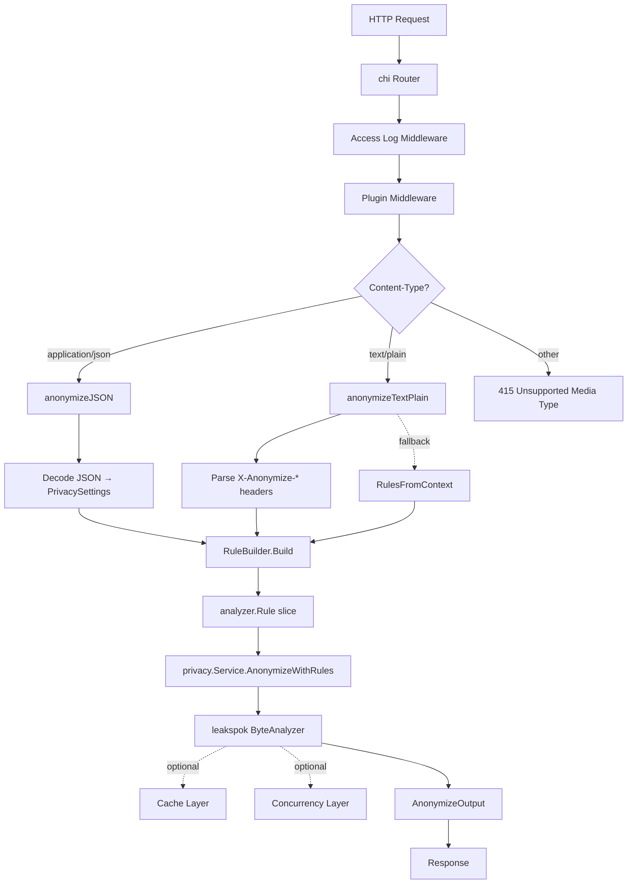

# Architecture

## Design Philosophy

The anonymizer is built to handle large text payloads — such as AI prompts and log streams — with minimal overhead. Every design choice targets low latency and efficient resource consumption.

- **Byte-level processing:** The entire pipeline uses `[]byte`. No string conversions, no unnecessary allocations. The `ByteString` type enables zero-copy JSON marshaling.
- **Buffer pooling:** `sync.Pool` reuses response buffers and entity maps across requests, reducing GC pressure under load.
- **Pluggable caching:** Rule matching results are cached. In-memory client-side caching avoids network round-trips for hot paths. Optional Redis/Valkey backends share state across replicas using server-assisted client-side caching.
- **Optional concurrency:** Token-level and rule-level parallelism can be enabled independently to saturate multiple CPU cores for large payloads.

## Request Flow



## Component Map

| Package | Responsibility | Public API |
|---------|---------------|------------|
| `pkg/server/` | Application builder, functional options, plugin registration, HTTP handler assembly | `AnonymizerServer`, `Option`, `WithPlugin`, `WithLogger`, `WithByteAnalyzer`, `CoreServices`, `MiddlewareRegistrar` |
| `internal/handler/` | HTTP handlers, content-type dispatch, JSON/text-plain parsing, error responses, buffer pooling | (internal) |
| `internal/monitoring/` | OpenTelemetry tracing, Prometheus metrics registry | (internal) |
| `pkg/privacy/` | Core anonymization service, rule builder, privacy settings types | `Service`, `RuleBuilder`, `PrivacySettings`, `EntitySettings`, `RedactionSettings`, `MaskSettings` |
| `pkg/config/` | Environment variable loading, settings validation | `EnvConfig`, `ServerConfig`, `ValidatePrivacyConfig` |
| `pkg/context/` | Context key/value helpers for rule injection | `WithRules`, `RulesFromContext` |

## Plugin System

Plugins implement the `MiddlewareRegistrar` interface to inject HTTP middleware that runs before the core anonymization handler:

```go
type MiddlewareRegistrar interface {
    Middleware(services CoreServices) func(http.Handler) http.Handler
}
```

The `CoreServices` struct provides plugins with a `*slog.Logger` and `analyzer.ByteAnalyzer`. Plugins inject rules into the request context via `WithRules(ctx, rules)`, and the handler retrieves them via `RulesFromContext(ctx)` as a fallback when no inline settings or headers are present.

See [Plugin Developer Guide](./plugins.md) for a complete walkthrough.

## Cache Layer

- **In-memory client-side caching:** Enabled by default when `PRIVACY_CACHE_ENABLED=true`. Uses Valkey's server-assisted client-side caching protocol to minimize network overhead.
- **Redis/Valkey backend:** Optional shared cache for multi-replica deployments. Configured via `PRIVACY_CACHE_REDIS_ADDR`.
- **Disable in-memory:** Set `PRIVACY_CACHE_DISABLE_IN_MEMORY=true` to use only the Redis backend.

## Concurrency Layer

When `PRIVACY_CONCURRENCY_ENABLED=true`:

- **Token-level parallelism:** Multiple tokens in a text are evaluated simultaneously. Controlled by `PRIVACY_CONCURRENCY_TOKEN_PROCESSING` and `PRIVACY_CONCURRENCY_TOKEN_POOL_SIZE`.
- **Rule-level parallelism:** Multiple rules are evaluated against each token simultaneously. Controlled by `PRIVACY_CONCURRENCY_RULE_PROCESSING` and `PRIVACY_CONCURRENCY_RULE_RUNNER_POOL_SIZE`.
- **Goroutine pools:** Sized goroutine pools with configurable idle reclamation (`PRIVACY_CONCURRENCY_MAX_GOROUTINE_IDLE_TIMEOUT`) prevent unbounded goroutine growth on large texts.

## See Also

- [Observability Guide](./observability.md) — metrics, tracing, and logging
- [Configuration Reference](./configuration.md) — all environment variables
- [Plugin Developer Guide](./plugins.md) — extending the service
